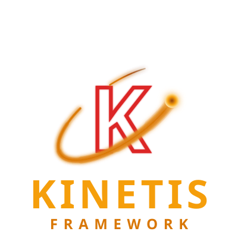

<p align="center">
  
</p>

<p align="center">
  <strong>kinetis/queue-redis</strong>
  <br>
  <strong>A Redis-backed queue implementation for kinetis/queue's <code>QueueInterface</code></strong>
</p>

<p align="center">
  <a href="https://packagist.org/packages/kinetis/queue-redis"></a>
  <a href="https://packagist.org/packages/kinetis/queue-redis"></a>
  <a href="https://packagist.org/packages/kinetis/queue-redis"></a>
  <a href="https://packagist.org/packages/kinetis/queue-redis"></a>
  <a href="https://github.com/kinetis-dev/kinetis/actions/workflows/ci.yml"></a>
</p>

---

Part of [Kinetis](https://kinetis.dev/), a non-blocking PHP framework for
API-first applications, developed in the
[kinetis-dev/kinetis](https://github.com/kinetis-dev/kinetis) monorepo.

Adds Redis as a queue backend. `push()`/`pop()`/`ack()`/`release()`/`fail()`
work exactly like any other backend — only your configuration changes. A
worker crash never silently loses a job: `pop()` atomically moves a job
from a `pending` list to a separate `processing` list rather than
deleting it, so a job whose worker never called `ack()`/`release()`/
`fail()` is stranded, not lost.

```php
use Kinetis\Config\Config;
use Kinetis\QueueRedis\RedisQueueFactory;

$queue = RedisQueueFactory::fromConfig($config);

$queue->push(new SendWelcomeEmail($email, $name), queue: 'default');
```

## Configuration

```
QUEUE_CONNECTION=redis
REDIS_HOST=127.0.0.1
```

This package introduces no configuration keys of its own — `REDIS_HOST`/
`REDIS_URL`/`REDIS_TLS`/... are the exact ones [`kinetis/cache-redis`](https://github.com/kinetis-dev/cache-redis)'s
`RedisSimpleCache` already reads, scoped by `QUEUE_CONNECTION_NAME` the
same way every other backend is. [`kinetis/queue`](https://github.com/kinetis-dev/queue)'s own keys
(`QUEUE_CONNECTION`, `QUEUE_MAX_ATTEMPTS`, ...) are documented in that
package; full reference:
[kinetis.dev/docs/config.html](https://kinetis.dev/docs/config.html).

## Installation

```sh
composer require kinetis/queue-redis
```

Requires PHP 8.4+, [`kinetis/framework`](https://github.com/kinetis-dev/framework), [`kinetis/queue`](https://github.com/kinetis-dev/queue), and
[`kinetis/cache-redis`](https://github.com/kinetis-dev/cache-redis). Full documentation:
[kinetis.dev/docs/queue-redis.html](https://kinetis.dev/docs/queue-redis.html).

## License

MIT — see [LICENSE](LICENSE).
